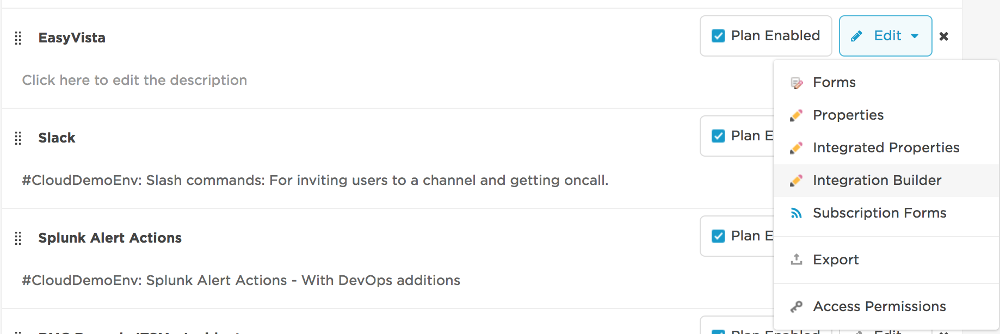
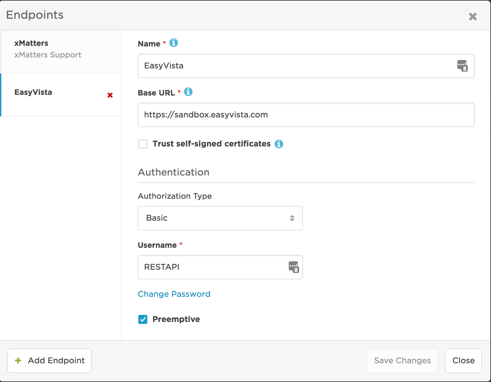
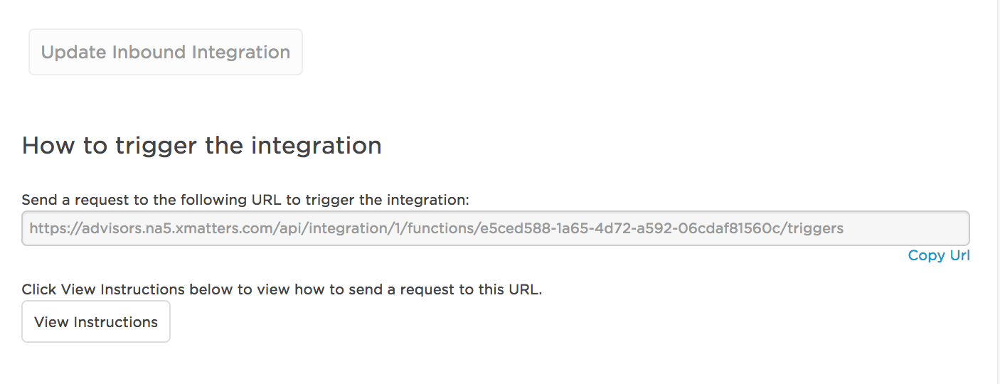
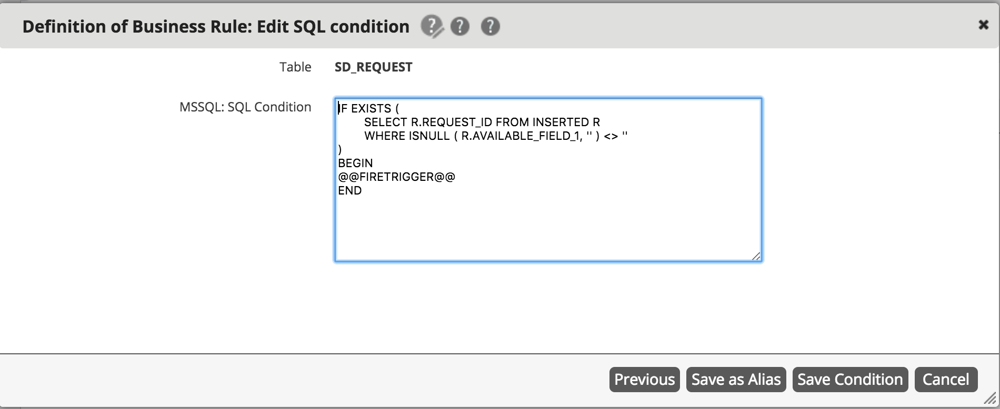
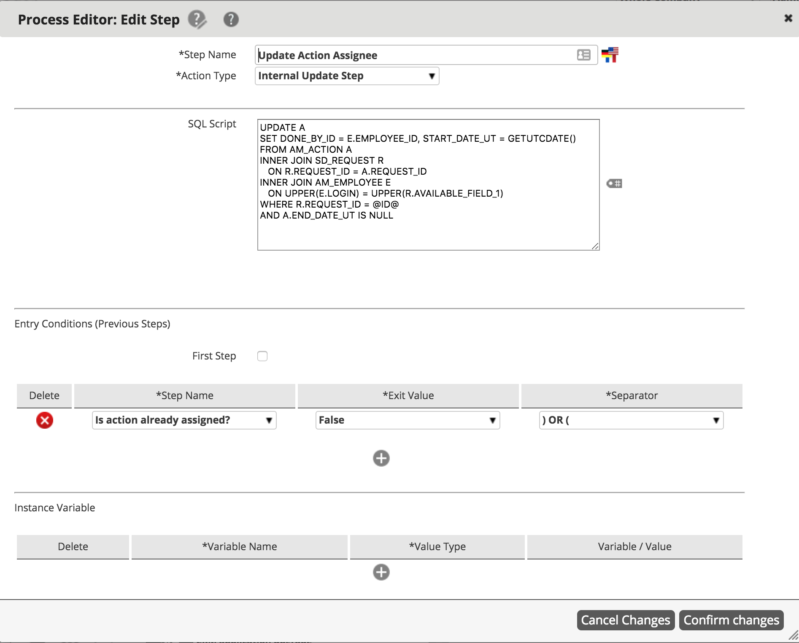
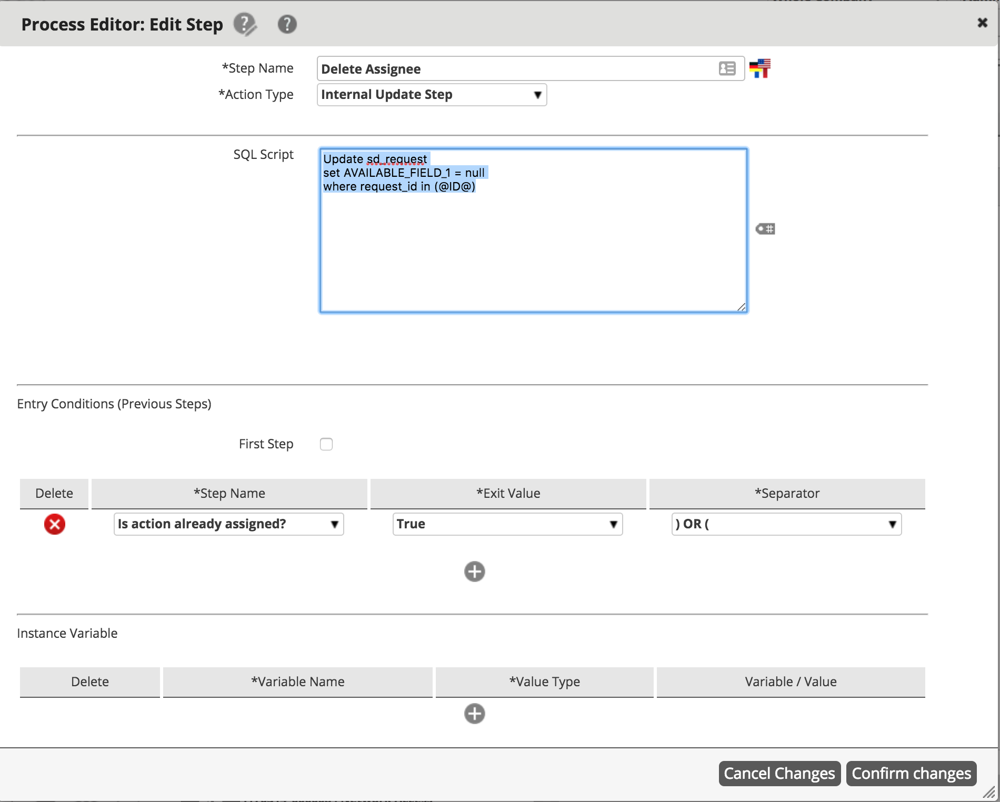
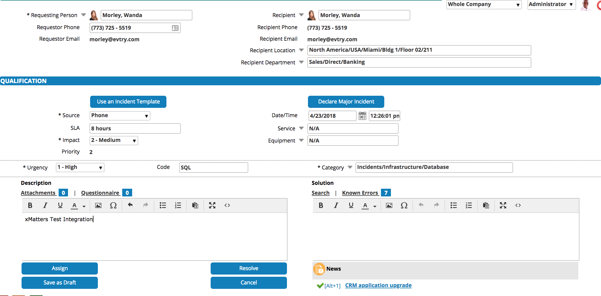
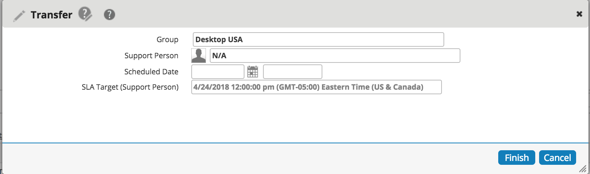
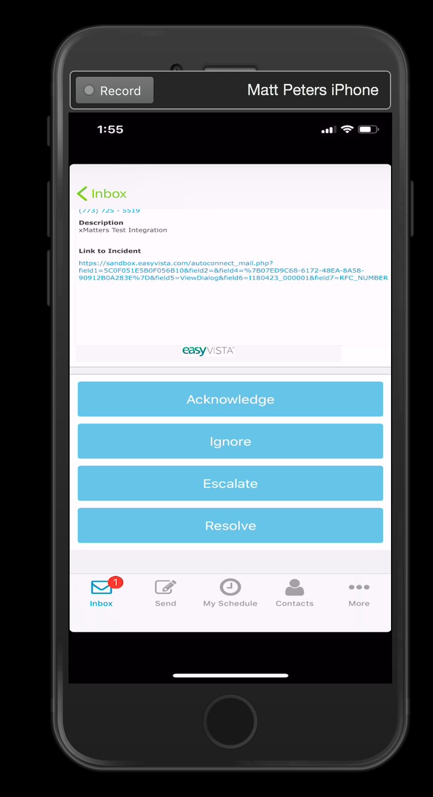
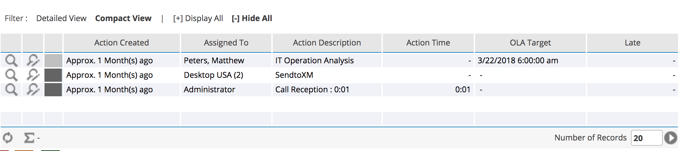

# xMatters + EasyVista Two Way Integration

The purpose of this xM lab is to set up a functional, two way integration between xMatters and EasyVista

# Prerequisites
In order to produce a fully working integration you must have a instance of xMatters, EasyVista and basic familiarity with SQL + JavaScript + JSON. You must also create a user profile with the same first name, last name and e-mail address in xMatters and EasyVista.

# Configuring xMatters

### Importing the Communication Plan
To get started with the integration with EasyVista, you must first [import](https://help.xmatters.com/OnDemand/xmodwelcome/communicationplanbuilder/exportcommplan.htm) the **EasyVista.zip** communication plan attached into your instance of xMatters. 

### Creating an Endpoint

Once the communication plan is imported, we'll need to create an Endpoint so xMatters can talk to EasyVista. We'll do that by navigating to the integration builder. 

<kbd>
    
</kbd>

Click on **Edit Endpoints** and add the your endpoint to the list in your instace. 

<kbd>
    
</kbd>

***Note*** *the user must have the REST API use profile in EasyVista* in this case, I created a user in EasyVista named **RESTAPI** with the *REST API* role. If you're not sure how to do this, you can go [here](https://wiki.easyvista.com/xwiki/bin/view/Documentation/WebService+REST#HBestPractice) and click on **Best Practice**

### Create a Group in xMatters
Once the communication plan is imported, you need to create a group in xMatters (I.E "EasyVistaDemo") and add yourself to that group.

# Configuring EasyVista

* To produce a fully working two-way integration with xMatters, configuring EasyVista correctly is key. The configuration with EasyVista is a bit more complex comapred to xMatters. Rest assured, we will go through each configuration step by step in this lab.

### Create a Catagory

* You'll want to select/create a Catagory to use in EasyVista if you want the integration to work for specific workflows. You can see how to do that [here](https://wiki.easyvista.com/xwiki/bin/view/Documentation/Incident+Catalog)

* Once that catagory is created, you'll want to assign it to the corresponding workflow that you'll use to create an incident. In this lab, we'll use **Incidents/Infrastructure/Database** as as or Catagory and **Incident:Database** as our workflow


<kbd>
    
</kbd>

### Creating a Service

1. The fist thing we'll need to do is create a service in xMatters. We'll do this by going to **Administration** < **REST** < **Service**.


<kbd>
    
</kbd>


* Click the **+** button next to **Services** and configure the service like so:

<kbd>
    
</kbd>

* Call the Service Name **xMatters**, set the Authentication Method the **Basic** and the Service Url should be the URL to your xMatters instance name. Click **Save**


### Creating a REST Connection

2. Next you must first create an API REST Connection with EasyVista. You can do that by clicking **Administration** < **REST** < **Connections**


<kbd>
    
</kbd>


* Click the **+** button next to **Connections** and add a new connection


<kbd>
    
</kbd>


* You can call the connection **xM Connection**, the Authentication Method can be **Basic** and in the **Service Url** field, include the name of your instance. User Name Authentication can be any user in xMatters that has the **REST Web Services User** roles. In this example, I have created a user specifically for this demo with the username "easyvista".


<kbd>
    
</kbd>


* Once this configuration is set up, you can click **Save**

### Creating a Resource

2. Next, we'll need to create a **Resource** in EasyVista. We will do this by going to **Administration** < **Rest** < **Resources**. 

<kbd>
    
</kbd>

* Click the **+** button next to **Resources**. You can call the **label** whatever you want; I have called it **xM Resource**, the service name will be whatever you called your service above, in my case it's **xMatters** and the **Connection Name** will be whatever you named your REST connection above (in my case, it's xM Connection). The uri is how EasyVista will trigger the xMatters integration. This can be found by heading to your xMatters instance, clicking on **Developer**, next to your **EasyVista** communication plan, click **Edit** and then **Integration Builder**.

<kbd>
    
</kbd>

* Click on **Inbound integration** and then click on **New Incident** and the bottom you'll find the URL to trigger the integration which you will put in the uri field. ***Note***: *do not enter the entire URL, only the URL that is followed by*  **.com** *starting with* **/api/.../etc**


<kbd>
    
</kbd>

* In the content field, you'll want to add the following xMatters JSON payload. ***Note** the `recipients` value is going to be the group you have created in xMatters that you are trying to target. In my case, the group name is **EasyVistaDemo**

``` {
  "properties": 
  {"Incident_Number": "{Incident_Number}",
    "Urgency_ID": "{Urgency_ID}",
    "Impact": "{Impact}",
    "Description": "{myDescription} ",
    "Category": "{Category}",
    "Requesting_Person": "{Requesting_Person}",
    "Department": "{Department}",
    "Incident_Status": "{Incident_Status}",
    "Recipient": "{Recipient}",
    "Recipient_Phone": "{Recipient_Phone}",
     "SLA":"{SLA}"   
  },
  "recipients": [
    "EasyVistaDemo"
  ]
}

```

<kbd>
    
</kbd>


3. The next thing we'll need to do is edit your current workflow so EasyVista knows how and when to trigger an event in xMatters. In this example, I am editing the workflow **Incident:Database**. 

<kbd>
    
</kbd>

* To add REST xM Connection we just created, click into **REST ACTIONS** and drag the xM Connection box into the workflow. If you don't know how to create a workflow in EasyVista, you can look [here] (https://wiki.easyvista.com/xwiki/bin/view/Documentation/Workflow)
You can name the workflow whatever you want. Here, I have named it **SendtoXM**. The entry status should be **In Progress** The REST CONNECTION should be **xM Connection** and the resource should be **xM Resource**. The parameters that we are sending to xMatters should be populated under "parameters" (the JSON we defined earler). Once you make sure the values match the parameters, you can click "Confirm Changes".

<kbd>
    
</kbd>


### Creating a Business Rule

4. In order for a proper two way integration to successfully work, we'll need to create a business rule in EasyVista. We'll do that by clicking **Administration < Business Rules < Definition**. Click the **+** button to create a new business rule. Select the table **SD_Request**


<kbd>
    
</kbd>

* You can name the business rule anything you'd like. Here, I named it **"xMatters Action Assignment"**. In the "Field" drop down, select **AVAILABLE_FIELD_1**. Click edit conditon and paste the following SQL:

<kbd>
    
</kbd>


* Click edit conditon and paste the following SQL:

```
IF EXISTS (
	SELECT R.REQUEST_ID FROM INSERTED R
	WHERE ISNULL ( R.AVAILABLE_FIELD_1, '' ) <> ''
)
BEGIN
@@FIRETRIGGER@@
END

```

<kbd>
    
</kbd>

### Creating a Related Process

5. Next, we'll need to create a related process in EasyVista. We'll do this by going to **Administration < Business Rules < Related Process** . Click the **+** button to add a new Related Process. We can call this **xMatters Action Assignment** as well. Once the Process is created, click the drop down **Automatic Actions** and select **Internal Step Update**. We will need two of these steps. Name one **Delete Assignee** and the other **Update Action Assignee**. Paste the following SQL code into **Update Action Assignee**

``` 
UPDATE A
SET DONE_BY_ID = E.EMPLOYEE_ID, START_DATE_UT = GETUTCDATE()
FROM AM_ACTION A
INNER JOIN SD_REQUEST R 
   ON R.REQUEST_ID = A.REQUEST_ID
INNER JOIN AM_EMPLOYEE E
   ON UPPER(E.LOGIN) = UPPER(R.AVAILABLE_FIELD_1)
WHERE R.REQUEST_ID = @ID@
AND A.END_DATE_UT IS NULL

```
* Click Save

* Be sure that the **Step Name, Exit Value and Separator** match the screen shot below

<kbd>
    
</kbd>


* Paste the following code into **Delete Assignee**


```

Update sd_request
set AVAILABLE_FIELD_1 = null
where request_id in (@ID@)

```

<kbd>
    
</kbd>


### Two Way Integration in Action

* From the EasyVista home page, click on **New < Incident**. Fill out the incident form below like so. **Note** make sure the **Catagory** matches catagory you created. In our case it is: **Incidents/Infrastructure/Database**. Make sure the rest of the mandatory fields are filled out like the screen shot below and click **Assign**


<kbd>
    
</kbd>

* Once **Assign** is clicked, it will automatically generate a group. Do not modfiy the group; just click **Finish**


<kbd>
    
</kbd>

* Once the incident is opened, you should receive a notification from xMatters

<kbd>
    
</kbd>

<kbd>
    
</kbd>


* If you click **Acknowledge** EasyVista will assign you the work order like so:


<kbd>
    
</kbd>


