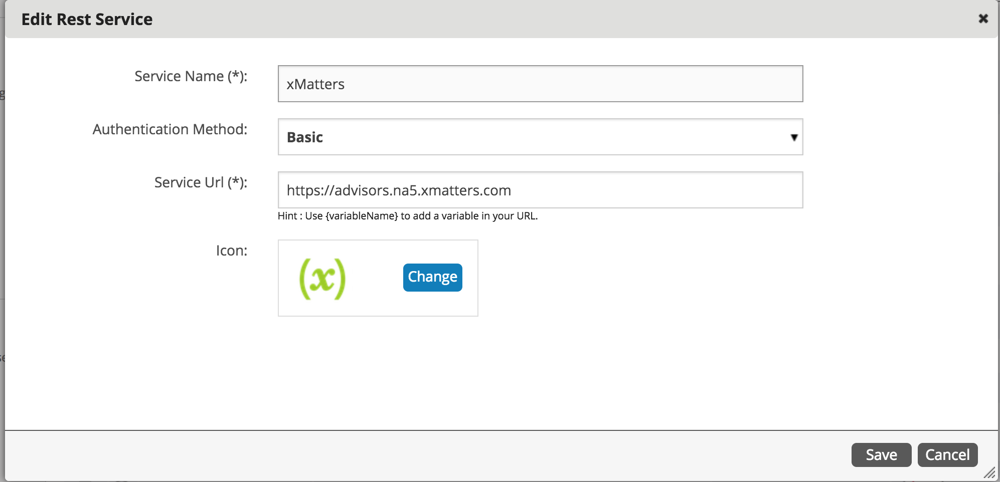
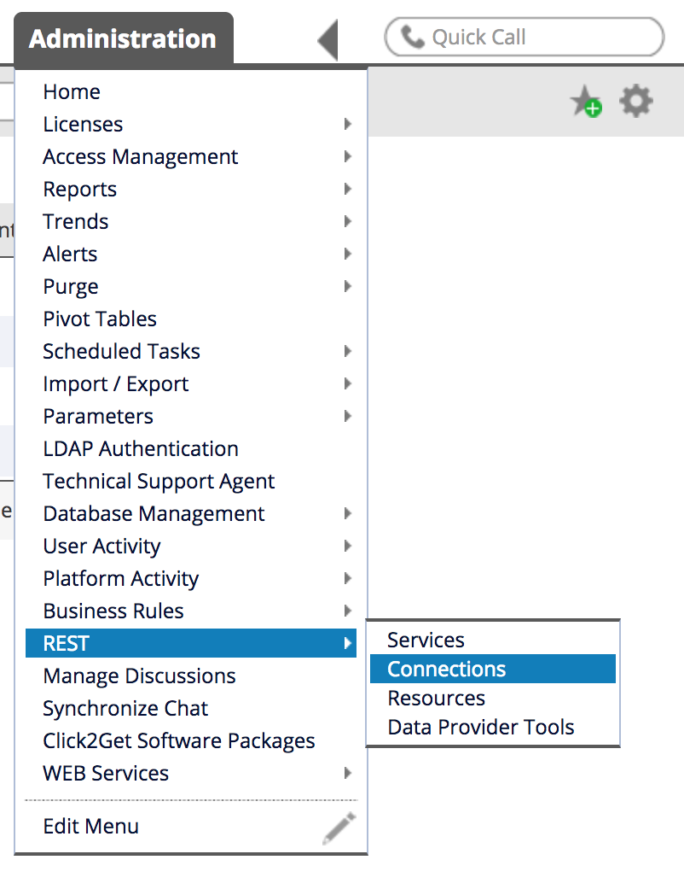
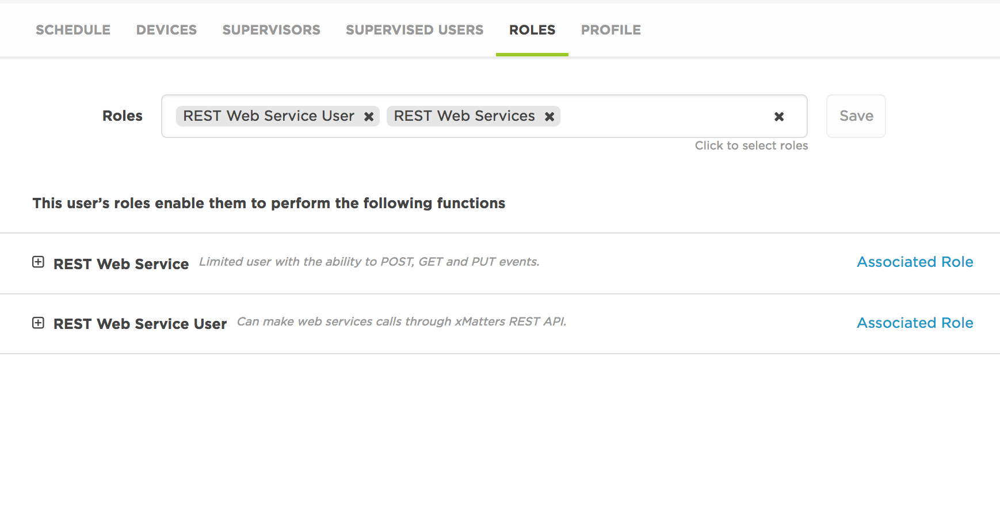
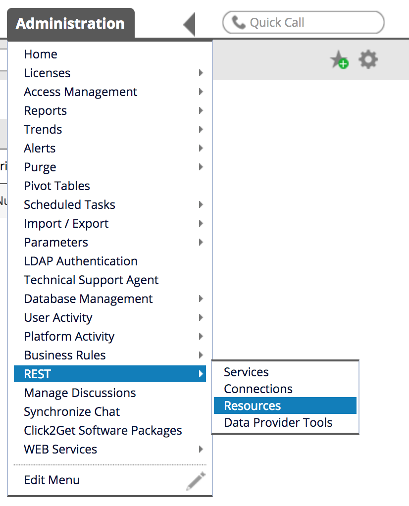
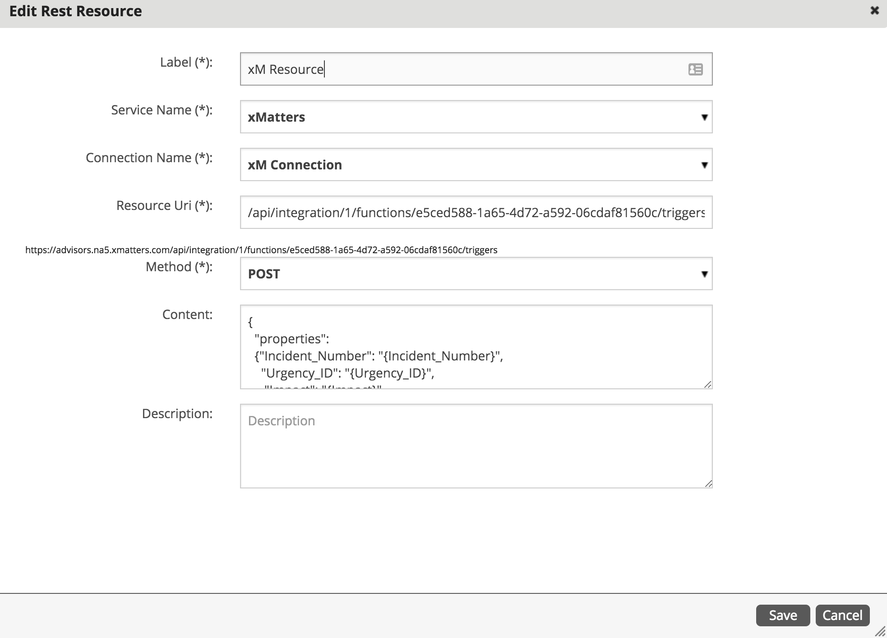

# xMatters + EasyVista Two Way Integration

# Prerequisites
In order to produce a fully working integration you must have a instance of xMatters and EasyVista and basic familiariy with SQL and JavaScript

# Getting Started
To get started with the integration with EasyVista, you must first [import](https://help.xmatters.com/OnDemand/xmodwelcome/communicationplanbuilder/exportcommplan.htm) the **EasyVista.zip** commmunication plan attatched. 

Once the communication plan is imported, you need to create a group in xMatters (I.E "EasyVistaDemo") and add yourself to that group.

# Configuring EasyVista

To produce a fully working two way integration with xMatters, configuring EasyVista correctly is key. The configuration with EasyVista is a bit more complex comapred to xMatters. Rest assured, we will go through each configuration step by step in this lab.


### Creating a Service

1. The fist thing we'll need to do is create a service in xMatters. We'll do this by going to **Administration** < **REST** < **Service**.


<kbd>
    
</kbd>


Click the **+** button next to **Services** and configure the service like so:

<kbd>
    
</kbd>

Call the Service Name **xMatters**, set the Authentication Method the **Basic** and the Service Url should be the URL to your xMatters instance name. Click **Save**


### Creating a REST Connection

2. Next you must first create an API REST Connection with EasyVista. You can do that by clicking **Administration** < **REST** < **Connections**


<kbd>
    
</kbd>


Click the **+** button next to **Connections** and add a new connection


<kbd>
    
</kbd>


You can call the connection **xM Connection**, the Authentication Method can be **Basic** and in the **Service Url** field, include the name of your instance. User Name Authentication can be any user in xMatters that has the **REST Web Services User** roles. In this example, I have created a user specifically for this demo with the username "easyvista".


<kbd>
    
</kbd>


Once this configuration is set up, you can click **Save**

### Creating a Resource

2. Next, we'll need to create a **Resource** in EasyVista. We will do this by going to **Administration** < **Rest** < **Resources**. 

<kbd>
    
</kbd>

Click the **+** button next to **Resources**. You can call the **label** whatever you want; I have called it **xM Resource**, the service name will be whatever you called your service above, in my case it's **xMatters** and the **Connection Name** will be whatever you named your REST connection above (in my case, it's xM Connection)

In the content, you'll want to add the following xMatters JSON payload: the `recipients` value is going to be the group you have created in xMatters that you are trying to target. In my case, the group name is **EasyVistaDemo**

``` {
  "properties": 
  {"Incident_Number": "{Incident_Number}",
    "Urgency_ID": "{Urgency_ID}",
    "Impact": "{Impact}",
    "Description": "{myDescription} ",
    "Category": "{Category}",
    "Requesting_Person": "{Requesting_Person}",
    "Department": "{Department}",
    "Incident_Status": "{Incident_Status}",
    "Recipient": "{Recipient}",
    "Recipient_Phone": "{Recipient_Phone}",
     "SLA":"{SLA}"   
  },
  "recipients": [
    "EasyVistaDemo"
  ]
}

```

<kbd>
    
</kbd>


3. The next thing we'll need to do is edit your current workflow so EasyVista knows how and when to trigger an event in xMatters. In this example, I am editing the workflow **Incident:Database**. 

To add REST xM Connection we just created, click into **REST ACTIONS** and drag the xM Connection box into the workflow. You can name the workflow whatever you want. Here, I have named it **SendtoXM**.

<kbd>
    
</kbd>


**TODO


<kbd>
    
</kbd>

